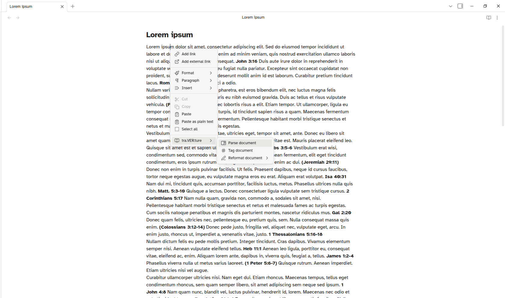

# tra.VER:ture – Obsidian plugin

> **traverture** (n.): The act of traversing text to find, convert, and reformat scripture references – a turning across formats, translations, and styles. From Latin *trans-* ("across") + *vertere* ("to turn") + *-ura* (action/result).

A scripture reference parser and formatter for Obsidian. Create interactive links with verse previews, or parse entire documents into a searchable, sortable sidebar table.

## Security and Privacy

If you are concerned about the "Scorecard" review or the "Caution" warning on the [Obsidian Community plugins page](https://community.obsidian.md/plugins/traverture), see [SECURITY](https://github.com/erykjj/traverture?tab=security-ov-file).

---

## Features

- **Inline reference parsing** – Wrap any text containing scripture references in `{{ }}` to create clickable links (in View mode). Surrounding text is preserved. Multiple references within a single block are all detected.

  ```text
  {{this is John 17:17 and Ps 1:1-3 end of test}}
  ```
  Produces two clickable links: `John 17:17` and `Ps 1:1-3`

- **Verse preview modal** – Click any reference to open a modal with the full scripture text[^1] and buttons to copy the text, or open in *JW Library*[^2] or [*JW.ORG*](https://jw.org).

- **Sidebar table** – Parse a selection or entire document into a searchable, sortable table with columns for Original, Full, Standard, and Official name formats, BCV codes, and chapter and verse numbers. Features include:
  - Accent-insensitive search/filter
  - Sort by any column (ascending/descending/original order)
  - Column visibility toggles
  - Translation language dropdown with live book name translation
  - Option to render book names in all-caps
  - Option to filter out duplicate entries
  - Copy table (with current filter/sort, etc.) to clipboard (TSV format)

- **Tag references** – Enclose all scripture references in a selection or document with `{{ }}` markers.

- **Insert citation** – Replace a scripture reference with the full verse text[^1]. Two formats available:
  - `Reference: "verse"` – preserves verse numbers
  - `"verse" (Reference)` – plain text without verse numbers

- **Reformat references** – Convert references between Full (1 Corinthians), Standard (1 Cor.), and Official (1Co) name formats. Works on selections or entire documents.

- **Multi-language support** – Parse references in any supported language, and display or fetch verse text in a different language.
  - Supported languages: Danish, Dutch, English, French, German, Italian, Japanese, Korean, Mandarin Chinese (simplified), Norwegian, Polish, Portuguese, Russian, Spanish, Swedish, Ukrainian



---

## Usage

### Desktop
Right-click text selection or anywhere in the editor to access:
- **Parse selection / Parse document** – Open the sidebar table
- **Insert citation** – Choose `Reference: "verse"` or `"verse" (Reference)`
- **Tag selection / Tag document** – Wrap references in `{{ }}`
- **Reformat selection / Reformat document** – Convert between name formats

### Mobile
Tap the three-line hamburger menu and look for **tra.VER:ture** (scroll icon) to access all commands.

---

## Settings

- **Source language** – Language of the scripture references in your notes
- **Output language** – Language for displaying book names in the sidebar and fetching verse text for previews

---

## Performance

Depending on the length of the scripture passage and the device, initial verse lookup requires a network request and may take a moment. Parsing large documents on mobile may take a few seconds.

---

## Installation & Updating

1. In your vault's `.obsidian/plugins/` directory, make a directory (folder) called `traverture`, if you don't already have one
2. Download [main.js](https://github.com/erykjj/traverture/releases/latest/download/main.js), [styles.css](https://github.com/erykjj/traverture/releases/latest/download/styles.css) and [manifest.json](https://github.com/erykjj/traverture/releases/latest/download/manifest.json) and put them in that directory (over-writing to update)
3. If not already enabled, enable the plugin in Obsidian Settings → Community plugins
4. Configure source and output languages in the plugin settings (if installing for the first time)

______

[^1]: Bible citation text is taken from [*New World Translation of the Holy Scriptures*](https://www.jw.org/en/library/bible/study-bible/books/) (*NWT*) (© Watch Tower Bible and Tract Society of Pennsylvania). In the future, other translations may be included.

[^2]: [JW Library](https://www.jw.org/en/online-help/jw-library/) is a registered trademark of Watch Tower Bible and Tract Society of Pennsylvania.
