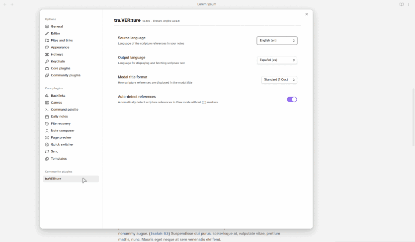

 

# tra.VER:ture – Obsidian plugin

> **traverture** (n.): The act of traversing text to find, convert, and reformat scripture references – a turning across formats, translations, and styles. From Latin *trans-* ("across") + *vertere* ("to turn") + *-ura* (action/result).

A scripture reference parser, formatter, and viewer for Obsidian. Automatically creates interactive links with verse previews; allows parsing selection or entire documents into a searchable, sortable sidebar table. *Invenire et convertere* ("To find and convert").

## Security and Privacy

If you are concerned about the "Scorecard" review or the "Caution" warning on the [Obsidian Community plugins page](https://community.obsidian.md/plugins/traverture), see [SECURITY](https://github.com/erykjj/traverture?tab=security-ov-file).

---

## Features

- **Automatic reference detection** – Scripture references are automatically detected in both View and Edit modes. Works with most book name variants and common abbreviations (e.g., "2 Sam.", "II Samuel", "2Sa"). References can also be force-detected by wrapping them in `{{ }}` (e.g., `{{Song of Solomon 1:1}}`). See [Known Limitations](#known-limitations) for edge cases.

- **Verse preview modal** – Click any reference to open a modal with the full scripture text[^1] (with cross-reference and footnote tooltips), a study-note pane (where available) and buttons to copy the text, or open in *JW Library*[^2] or [*JW.ORG*](https://jw.org)[^3]. `Ctrl/Cmd`+click opens references directly in *JW Library* (if installed).

- **Sidebar table** – Parse a selection or entire document into a searchable, sortable table with columns for Original, Full, Standard, and Official name formats, BCV codes, and chapter and verse numbers. Features include:
  - Accent-insensitive search/filter
  - Sort by any column (ascending/descending/original order)
  - Column visibility toggles
  - Output language dropdown with live book name translation
  - Option to render book names in all-caps
  - Option to filter out duplicate entries
  - Copy table (with current filter/sort, etc.) to clipboard (TSV format)

- **Insert citation** – Replace a scripture reference with the full verse text[^1]. Two formats available:
  - `Reference: "verse"` – preserves verse numbers
  - `"verse" (Reference)` – plain text without verse numbers

- **Reformat references** – Convert references between Full (e.g., "1 Corinthians"), Standard (e.g., "1 Cor."), and Official (e.g., "1Co") name formats. Works on selections or entire documents.

- **Multi-language support** – Parse references in any supported language, and display or fetch verse text in a different language.
  - Supported languages: ASL, Cebuano, Danish, Dutch, English, Estonian, French, German, Haitian Creole, Hungarian, Italian, Japanese, Korean, Mandarin Chinese (simplified), Norwegian, Polish, Portuguese, Romanian, Russian, Spanish, Swedish, Tagalog, Ukrainian
    - ASL (American Sign Language) is available as an output language only; links open directly to the video segment for the verse range.

- **Desktop and mobile support**

---

## Settings

- **Source language** – Language of the scripture references in your notes
- **Output language** – Language for displaying book names and fetching verse text
- **Modal title format** – How references are displayed in the verse preview title (Full, Standard, Official)
- **Auto-detect references** – Toggle automatic detection without `{{ }}` markers

---

## Known Limitations

- **Whole books** (like "James") are not detected unless preceded by a number (e.g., "1 John"). Use braces if detection is desired (e.g., `{{Obadiah}}`)
- **"Song of Solomon"** and its variants are not auto-detected. Use `{{Song of Solomon 1:1}}` to force detection.
- **Ambiguous references** like "1 John 5:3; 2 John 4" may parse incorrectly as "1 John 5:3; 2" (as in, 1 John chapter 2) and "John 4". Force detection with braces: `1 John 5:3; {{2 John 4}}`.

---

## Performance

Depending on the length of the scripture passage and the device, initial verse lookup requires a network request and may take a moment. Parsing large documents on mobile may take a few seconds.

---

## Installation & Updating

1. In your vault's `.obsidian/plugins/` directory, make a directory (folder) called `traverture`, if you don't already have one
2. Download [main.js](https://github.com/erykjj/traverture/releases/latest/download/main.js), [styles.css](https://github.com/erykjj/traverture/releases/latest/download/styles.css) and [manifest.json](https://github.com/erykjj/traverture/releases/latest/download/manifest.json) and put them in that directory (over-writing to update)
3. If not already enabled, enable the plugin in Obsidian Settings → Community plugins
4. Configure source and output languages in the plugin settings (if installing for the first time)

---

Feel free to get in touch and post any [issues and/or suggestions](https://github.com/erykjj/traverture/issues).

______

[^1]: Bible citation text is taken from [*New World Translation of the Holy Scriptures*](https://www.jw.org/en/library/bible/study-bible/books/) (*NWT*) (© Watch Tower Bible and Tract Society of Pennsylvania).

[^2]: [*JW Library*](https://www.jw.org/en/online-help/jw-library/) is a registered trademark of Watch Tower Bible and Tract Society of Pennsylvania.

[^3]: *JW Library* may intercept these links by default.
